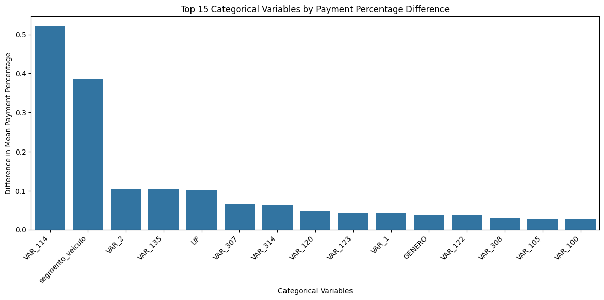

# Sistema de Previsão de Pagamentos e Gestão de Cobranças

## Introdução

Este projeto consiste em uma solução completa para previsão de comportamento de pagamento e gestão de cobranças, desenvolvida para auxiliar empresas a otimizar seu processo de recuperação de crédito. O sistema utiliza técnicas avançadas de machine learning para classificar clientes de acordo com sua probabilidade de pagamento, permitindo uma abordagem mais estratégica e personalizada nas ações de cobrança.

### Principais Funcionalidades

- Previsão do comportamento de pagamento dos clientes através de modelo XGBoost
- Classificação dos clientes em diferentes perfis de pagamento
- Interface web interativa desenvolvida em Streamlit para visualização e gestão
- Sistema automatizado de envio de mensagens de cobrança via WhatsApp
- Acompanhamento em tempo real das métricas de sucesso das cobranças

### Tecnologias Utilizadas

O projeto foi desenvolvido utilizando as seguintes tecnologias:

- Python 3.13
- Streamlit para interface web
- Pandas e NumPy para manipulação de dados
- Scikit-learn e XGBoost para machine learning
- Matplotlib, Seaborn e Plotly para visualizações
- Integração com API do WhatsApp para envio de mensagens

Esta solução visa aumentar a eficiência do processo de cobrança, reduzir custos operacionais e melhorar a taxa de recuperação de crédito através de uma abordagem data-driven e automatizada.

## Desenvolvimento do Modelo

### Pré-processamento dos Dados

O desenvolvimento do modelo de previsão seguiu as seguintes etapas de pré-processamento:

1. **Limpeza dos Dados**
   - Remoção de colunas com mais de 40% de valores faltantes
   
   - Padronização de formatos de datas e valores monetários

2. **Engenharia de Features**
   - Criação de features temporais (aparições anteriores de um cliente no histórico de atrasos)
   - Imputação de uma flag MISSING para variáveis categóricas faltantes
   - Codificação de variáveis categóricas usando one-hot encoding
   - Imputação da mediana para variáveis numéricas
   - Normalização de variáveis numéricas usando o standardscaler
   - Transformação da variável alvo em flag (full_payment, partial_payment e no_payment)
   "[Dataset Balance](neuro/images/output_balance.png)

3. **Seleção de Features**
   - Análise de correlação entre variáveis numérica. Seleção das 9 melhores.
   
   - Análise de diferença de grupos para variáveis categóricas. Seleção das 8 melhores.
   

### Processo de Modelagem

O processo de desenvolvimento do modelo seguiu as seguintes etapas:

1. **Divisão dos Dados**
   - Separação em conjuntos de treino e oot.
   - Separação dos dados de treino em treino e teste.

2. **Treinamento do Modelo**
   - Utilização de gridsearch e crossvalidation para otimizar parametros testando modelos XGBoostClassifier, RandomForestClassifier e Regressão Logística
   - O melhor resultado foi apresentado pelo XGBoostClassifier

3. **Avaliação do Modelo**

   - Validação cruzada para robustez dos resultados
   - Métricas principais: precisão, recall e F1-score

         Classification Report:
                        precision    recall  f1-score   support

            full_payment     0.76      0.73      0.75     39399
            no_payment       0.60      0.32      0.42     40817
            partial_payment  0.47      0.78      0.59     30412

            accuracy                             0.59    110628
            macro avg        0.61      0.61      0.58    110628
            weighted avg     0.62      0.59      0.58    110628

   - Análise da matriz de confusão
   

4. **Interpretação**
   - O modelo será utilizado principalmente para identificar clientes com alta probabilidade de pagamento integral (full_payment) e parical (partial_payment), permitindo priorizar ações comerciais e de cobrança
   - A classe full_payment apresenta os melhores resultados de previsão e o partial_payment apresenta um bom recall.
   - Esta robustez na previsão de full_payment é especialmente útil pois:
     - Permite identificar com confiança clientes com maior propensão a pagar integralmente
     - Reduz o risco de ações comerciais mal direcionadas
     - Otimiza recursos ao focar em clientes com maior probabilidade de conversão
     - Possibilita estratégias personalizadas para diferentes perfis de pagamento

5. **Ações e Otimização de Negócio**
   - Com base nas previsões do modelo, diferentes estratégias podem ser aplicadas:
     - **Full Payment (Pagamento Integral)**
       - Envio de mensagens lembrando do pagamento
     
     - **Partial Payment (Pagamento Parcial)**
       - Oferta proativa de renegociação
       - Condições especiais de parcelamento
       - Descontos para quitação à vista
     
     - **No Payment (Sem Pagamento)**
       - Encaminhamento para equipe especializada de cobrança
       - Estratégias específicas de recuperação

